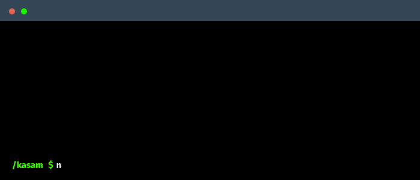

<h1><b>Hi there, I'm </b><a href="https://github.com/Kasammapara">Kasam Mapara</a> </h1>
 

  

&nbsp;***About me***

I’m a **Computer Engineering** student passionate about technology, problem-solving, and building full-stack applications. Currently in the final year of my degree, I’m expanding my knowledge across back-end, front-end, AI, and geospatial technologies.

I’ve gained practical experience through internships and hackathons, where I’ve built applications using modern stacks for real-world use cases — from restaurant websites to form builders and geospatial data analysis platforms. My goal is to continuously sharpen my development skills and explore new, meaningful technologies.

---

- 📚 I’m currently learning:
  - *Next.js* and *TypeScript*
  - *Cloud technologies (GCP & Docker)*
  - *Geospatial analysis with Google Earth Engine*

- 🚀 I’m always eager to join impactful open-source projects, hackathons, and research collaborations.

- 🤝 I love helping others with what I know and learning from fellow developers and researchers.

- 🎮 Outside tech, I enjoy:
  - Hanging out with friends  
  - Playing video games  
  - 🎧 Listening to music  
  - 🎸 Exploring musical instruments  

- 📫 Reach out to me at: [kasammapara13@gmail.com](mailto:kasammapara13@gmail.com)

---

    

     

<!-- Social Links -->

&nbsp;&nbsp;
&nbsp;&nbsp;
&nbsp;&nbsp;

 <!--  -->

 

&nbsp; ***Skills***

###### Languages & Syntax:
&nbsp;
&nbsp;

###### Frontend Development:
&nbsp;
&nbsp;
&nbsp;

###### Backend & Frameworks:
&nbsp;
&nbsp;

###### Deployment & Cloud Services:
&nbsp;
&nbsp;

<!-- #### ML/DL -->

###### Database Management:
&nbsp;
&nbsp;

###### Development Tools:
&nbsp;
&nbsp;
&nbsp;
&nbsp;

###### Development Environments:
&nbsp;
&nbsp;
&nbsp;
 
 
<!-- Github Stats -->
&nbsp;***Github Stats***

 

<table align="center">
<tr>
<td width="50%" align="center">
    
    
</td>
<td width="50%" align="center">
    
</td>
</tr>
</table>

 
